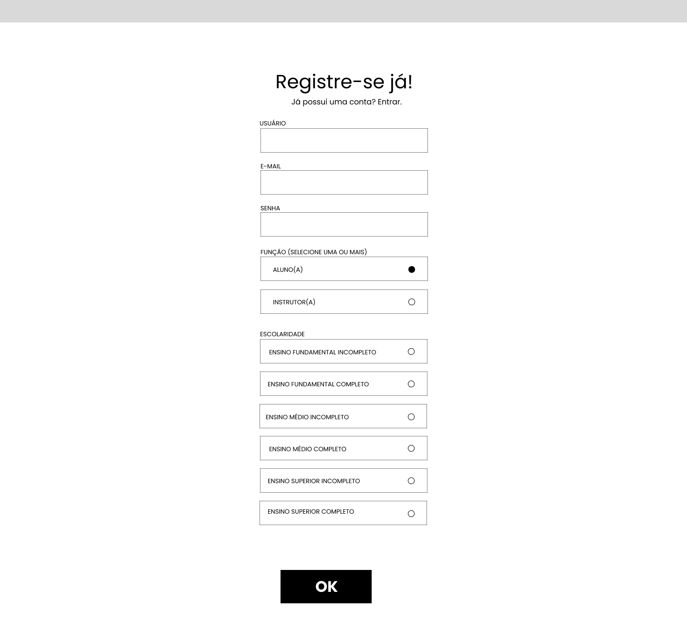
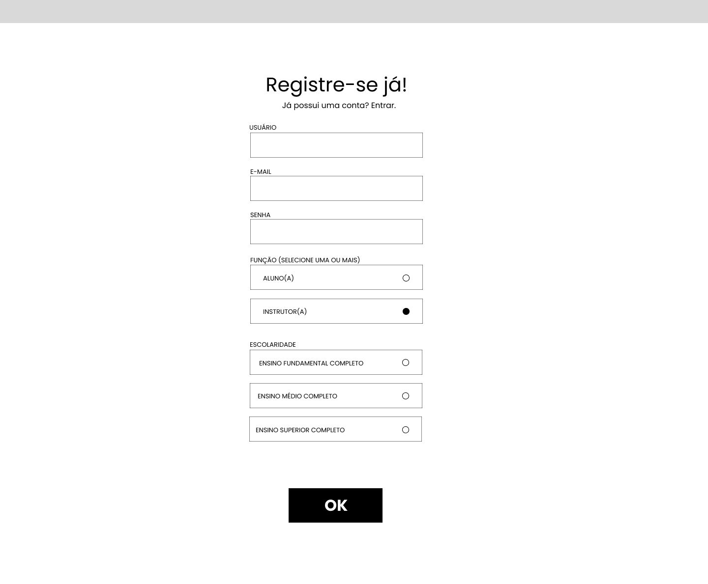
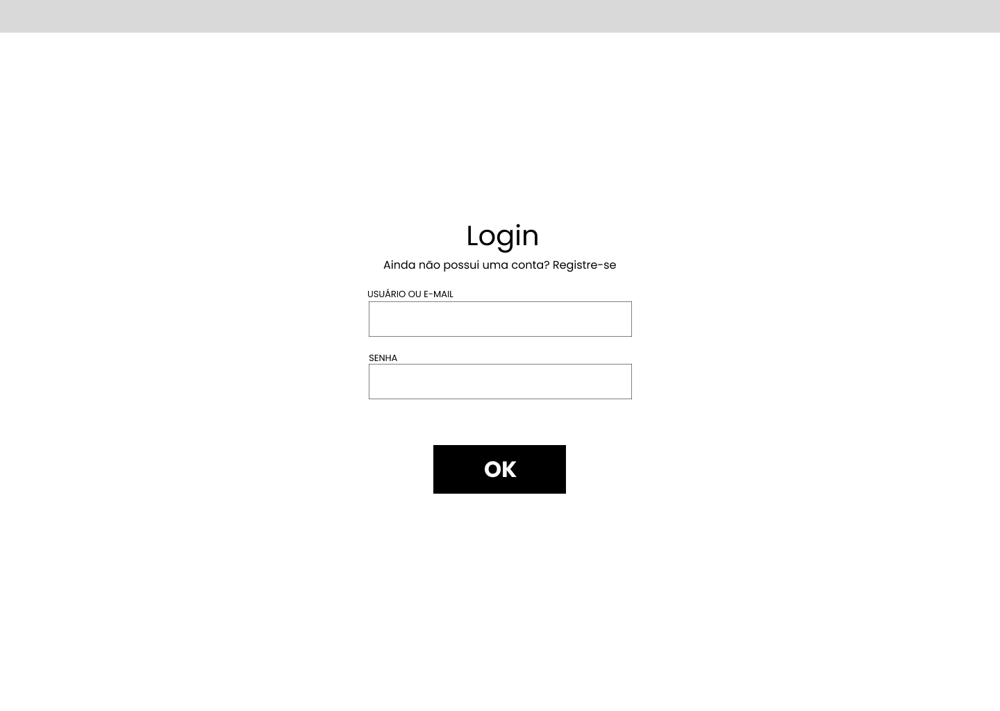
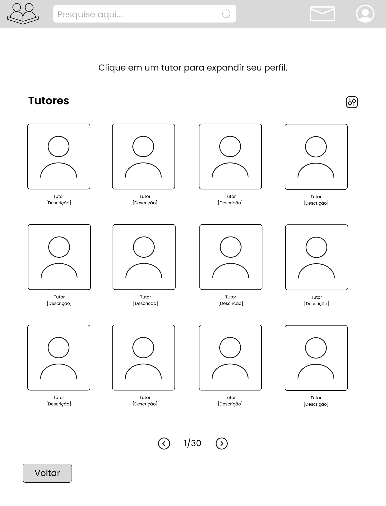

# 🖼️ Wireframes

## Tela inicial
A tela inicial possui uma breve introdução sobre o projeto, e possui opções para o usuário fazer login ou se cadastrar caso não tenha uma conta.


## Cadastro
No cadastro, o usuário digita seu nome de usuário, e-mail e senha, e seleciona se deseja ser aluno (pedir ajuda para estudos) ou instrutor (lecionar alunos sobre tópicos a escolha do usuário) ou ambos.


Alunos a partir do fundamental podem fazer uso da ferramenta.



Instrutores são restritos para pessoas que, no mínimo, completaram o ensino fundamental. Além disso, instrutores devem mandar um certificado de conclusão da escola/ensino superior, garantindo que possuem educação sobre as matérias as quais irão dar aula.




## Login
No login, o usuário digita seu nome de usuário ou e-mail e senha.


## Tópicos
Ao realizar o login, o usuário pode escolher um ou mais tópicos que deseja ajuda.


## Tutores
Após a seleção dos tópicos, o aplicativo direciona o usuário a uma tela com os tutores que ensinam os tópicos escolhidos.




# 📚 Tutorial
 
## 1. Estrutura de pastas

```text
src/
	assets/                 Imagens e vetores usados pelas páginas
	common/
		auth.css              Componentes comuns de formulário
		components.css        Componentes reutilizáveis
		global.css            Regras gerais compartilhadas
	pages/
		home/                 Tela inicial
		login/                Tela de login
		register/             Tela de cadastro
		topics/               Seleção de tópicos
		tutors/               Lista de tutores
tutorial/
	tutorial.md             Este guia
	wireframes/             Wireframes (protótipo inicial)
```

Cada página tem um par HTML/CSS. Os estilos comuns ficam em `src/common`, para evitar repetir fonte, reset, cabeçalho e conteúdo em todas as telas.

## 2. Como abrir o projeto

Não há arquivo de dependências nem etapa de compilação. Basta abrir um destes arquivos:

```text
src/pages/home/home.html
src/pages/login/login.html
src/pages/register/register.html
src/pages/topics/topics.html
src/pages/tutors/tutors.html
```

## 3. Estrutura HTML comum

Todas as páginas começam com a mesma base:

```html
<!DOCTYPE html>
<html lang="pt-BR">
```

`DOCTYPE` informa que o documento usa HTML5, e o atributo `lang` identifica o idioma como português do Brasil, o que ajuda leitores de tela e mecanismos de busca.

No `<head>` aparecem três itens importantes:

- `charset="UTF-8"` permite caracteres como acentos.
- `viewport` faz a página respeitar a largura de celulares.
- Um ou mais `<link rel="stylesheet">` carregam os arquivos CSS.

O corpo usa elementos semânticos:
- `<header>` representa o cabeçalho;
- `<main>` representa o conteúdo principal;
-  `<section>` agrupa uma parte da tela;
-  `<article>` representa um item independente, como um card de tópico ou tutor.

## 4. Estilos compartilhados

### `src/common/global.css`

O primeiro comando importa a fonte Poppins do Google Fonts:

```css
@import url('https://fonts.googleapis.com/css2?family=Poppins:wght@400;700&display=swap');
```

O seletor `*` aplica `box-sizing: border-box`, remove margens e remove preenchimentos padrão.
-  `border-box`, largura e altura incluem borda e padding, facilitando controlar o tamanho dos componentes.

O `body` define Poppins e fundo branco. O `.header` cria uma barra de 70 pixels, usa `display: flex` para alinhar seus filhos horizontalmente e `align-items: center` para centralizá-los na vertical.

As classes `.logo`, `.content`, `.title` e `.subtitle` formam regras genéricas reutilizadas nas telas internas:

- `.logo` controla a largura da marca.
- `.content` adiciona espaçamento ao conteúdo.
- `.title` centraliza e dimensiona o título principal.
- `.subtitle` cria o texto secundário cinza.

### `src/common/components.css`

Este arquivo contém componentes em comum entre as páginas. Por enquanto, somente a barra de pesquisa é reutilizada.
- `.search-bar` define a largura e a distância da busca em relação ao logo.
- `.search-bar input` faz o campo ocupar toda a largura do componente, remove a borda, arredonda os cantos e aplica a mesma fonte do restante da interface.

### `src/common/auth.css`

Este arquivo contém componentes comuns de formulário.
- `.subtitle a` define o estilo do link para a página de login ou cadastro.
- `.form` define o tamanho do campo de formulário.
- `.form-group` define o espaçamentro entre os campos de formulário e a entrada do usuário dentro deles.
- `.btn-submit` define o estilo do botão de enviar formulário.

## 5. Tela inicial: `home.html` e `home.css`

Seu conteúdo principal contém:

1. A imagem da marca, carregada por `../../assets/logo.png`.
2. Dois parágrafos dentro de `.home-description`.
3. Dois botões dentro de `.home-actions`, separados pelo texto `OU`.

No CSS:
- `.home-content` centraliza a tela;
- `.home-logo` fixa o tamanho da marca;
- `.home-description` limita o texto a 900 pixels e usa `margin: auto` para centralizá-lo.
- `.home-actions` usa flexbox em coluna, deixando os botões um abaixo do outro;
- `.home-button` define tamanho, borda, cor e cursor.
    - O seletor `:hover` muda a aparência quando o mouse passa por cima.

O separador `OU` usa pseudo-elementos:

```css
.divider::before,
.divider::after {
		content: "";
		flex: 1;
}
```

Esses elementos vazios viram duas linhas flexíveis, uma antes e outra depois do texto.

## 6. Cadastro: `register.html`, `auth.css`, `register.css` e  `register.js`

O cadastro usa um `<form>`, que é o elemento utilizado para reunir dados enviados pelo usuário. Cada campo fica em um `.form-group` e possui um `<label>` associado pelo mesmo valor de `for` e `id`:

```html
<label for="email">E-MAIL</label>
<input type="email" id="email" name="email">
```

Essa associação permite clicar no rótulo para focar o campo e melhora a leitura por tecnologias assistivas. Os tipos `text`, `email` e `password` informam ao navegador qual dado é esperado.

As funções são checkboxes, e não radio buttons, porque o texto permite selecionar uma ou mais funções. Os dois inputs usam o mesmo `name="funcao"` e valores diferentes (`aluno` e `instrutor`), o que identifica as escolhas quando o formulário for conectado a um backend.

O `<label class="checkbox-card">` envolve cada checkbox inteiro. Assim, clicar no card também pode alterar a seleção. O CSS esconde a aparência padrão com `appearance: none`, desenha um círculo e usa `:checked` para preencher o círculo quando selecionado.

O seletor abaixo estiliza somente o label comum do grupo, excluindo os labels dos cards:

```css
.form-group > label:not(.checkbox-card)
```

O arquivo `register.js` controla a validação do formulário antes do envio.
- Verifica se os campos obrigatórios foram preenchidos corretamente e se pelo menos uma função foi selecionada;
- Enquanto essas condições não forem atendidas, o botão OK permanece desabilitado;
- Quando o formulário se torna válido, o botão é habilitado e, ao enviá-lo, o JavaScript impede o comportamento padrão do formulário e redireciona o usuário para a página de tópicos.


## 7. Login: `login.html`, `auth.css` e `login.js`

O login usa um `<form>`, que é o elemento utilizado para reunir dados enviados pelo usuário. Cada campo fica em um `.form-group` e possui um `<label>` associado pelo mesmo valor de `for` e `id`:

```html
<label for="usuario">USUARIO OU E-MAIL</label>
<input type="text" id="usuario" name="usuario">
```

Essa associação permite clicar no rótulo para focar o campo e melhora a leitura por tecnologias assistivas. Os tipos `text` e `password` informam ao navegador qual dado é esperado.

O arquivo `login.js` verifica se os campos de usuário/e-mail e senha foram preenchidos corretamente.
- Enquanto o formulário estiver incompleto, o botão OK permanece desabilitado;
- Quando todos os campos obrigatórios estão válidos, o botão é habilitado e, ao enviar o formulário, o JavaScript impede o envio padrão e redireciona o usuário para a página de tópicos.


## 8. Seleção de tópicos: `topics.html`, `topics.css` e `topics.js`

O arquivo Javascript possui uma lista estática de tópicos com suas respectivas imagens que os representam.

A tela interna reaproveita o cabeçalho, o logo de `logo.png`, a barra de pesquisa e as classes comuns. O conteúdo tem uma grade `.topics-grid` com múltiplos `<article class="topic-card">`, carregados dinamicamente a partir do script em Javascript que percorre a lista de tópicos e carregando cada tópico em um card.

Cada card contém:

- um `<label>` que torna toda a área clicável;
- um checkbox com `name="topico"`;
- `.topic-image`, reservado para a imagem do tópico;
- `.topic-name`, com o nome exibido.

O checkbox fica oculto visualmente com `display: none`, mas continua sendo o controle que guarda a seleção. A mudança visual do card é feita por:

```css
.topic-card:has(.topic-checkbox:checked)
```

Esse seletor lê o estado do checkbox descendente e aplica uma borda mais grossa e um fundo diferente ao card. O recurso `:has()` é suportado pelos navegadores modernos, mas pode exigir atenção caso o projeto precise funcionar em navegadores antigos.

`.topics-grid` usa CSS Grid com três colunas fixas de 235 pixels. `gap` controla os espaços entre os cards. O botão `Buscar Tutores` está centralizado por `.button-container`, mas ainda não tem evento nem link para a tela de tutores.

O usuário pode filtrar os tópicos utilizando a barra de pesquisa. A entrada do usuário é lida, comparadas com o texto em `topic-name` e, aqueles que não batem com o input, são ocultos com `display: none`.

## 9. Lista de tutores: `tutors.html`, `tutors.css` e e `tutors.js`

O arquivo Javascript possui uma lista estática de tutores com suas respectivas fotos.

A página de tutores repete a estrutura do cabeçalho e cria uma grade `.tutors` com cards, carregados dinamicamente a partir de do script em Javascript que percorre a lista de tutores e carregando cada um em um card. Cada `.tutor-card` possui:

1. Um `.tutor-image` com a imagem JPG do tutor.
2. Um título `<h3>` com o nome.
3. Um `<p>` com uma descrição provisória.

O CSS de `.tutors` cria quatro colunas de 235 pixels. Dentro de cada card, flexbox centraliza a imagem e organiza nome e descrição verticalmente.

A paginação é um `<nav>` com `aria-label`, o que informa sua finalidade a leitores de tela. Os botões exibem as imagens `arrow-left.png` e `arrow-right.png`; o texto `1 / 30` é apenas estático. Os botões não alteram a página porque não há JavaScript ou links configurados.

O botão `Voltar` também é somente visual no estado atual.

O usuário pode filtrar os tutores utilizando a barra de pesquisa. A entrada do usuário é lida, comparadas com o texto em `tutor-name` e, aqueles que não batem com o input, são ocultos com `display: none`.

## 10. Assets

- `logo.png`: logo utilizada pelo site.
- `arrow-left.png` e `arrow-right.png`: setas da paginação.
- Pasta `topic-images`: imagens JPG dos tópicos.
- Pasta `tutor-images`: imagens JPG dos tutores.

SVG é um formato vetorial: o navegador interpreta suas formas, caminhos e atributos XML, mantendo boa qualidade ao redimensionar. Os arquivos de logo contêm imagens incorporadas em Base64, por isso são maiores que um SVG desenhado apenas com formas.

## 11. Limitações

O projeto ainda possui algumas limitações. Para virar uma aplicação completa, falta:

- ligar os botões às páginas com links ou JavaScript;
- validar e enviar o cadastro;
- persistir usuários e tópicos em um backend;
- implementar login;
- gerar tutores de forma dinâmica a partir dos tópicos escolhidos;
- fazer a paginação alterar os resultados;
- adicionar responsividade específica para telas menores, pois várias grades e larguras são fixas;
- preencher os nomes, descrições e imagens reais dos tutores e tópicos.