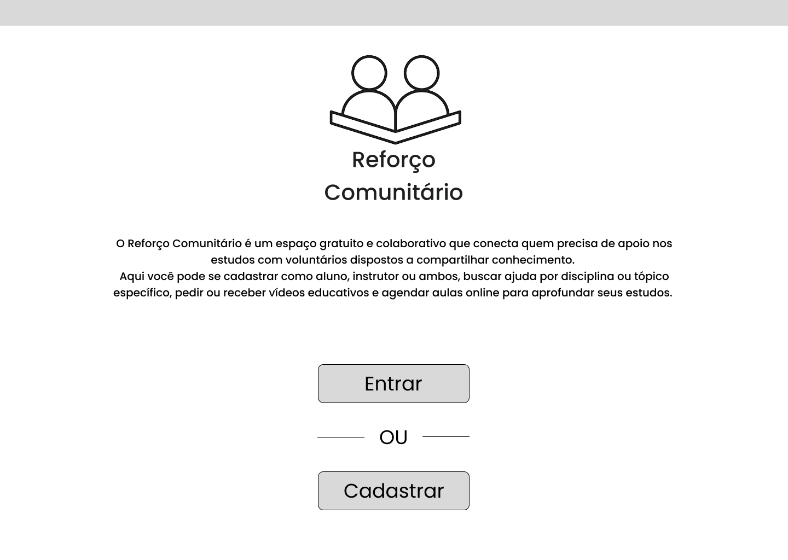
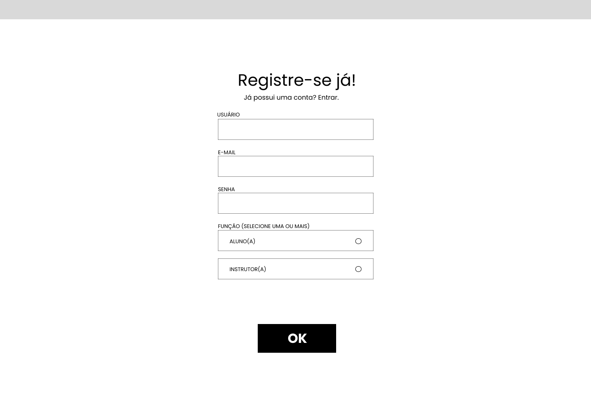
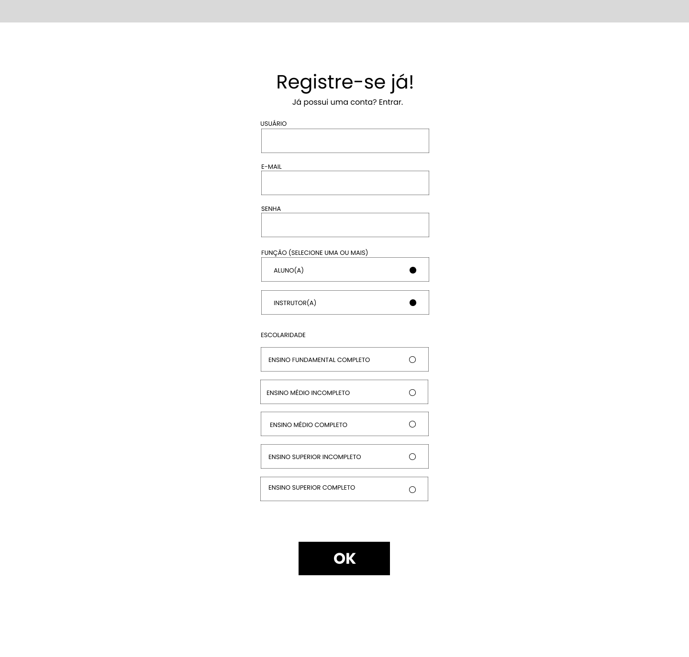
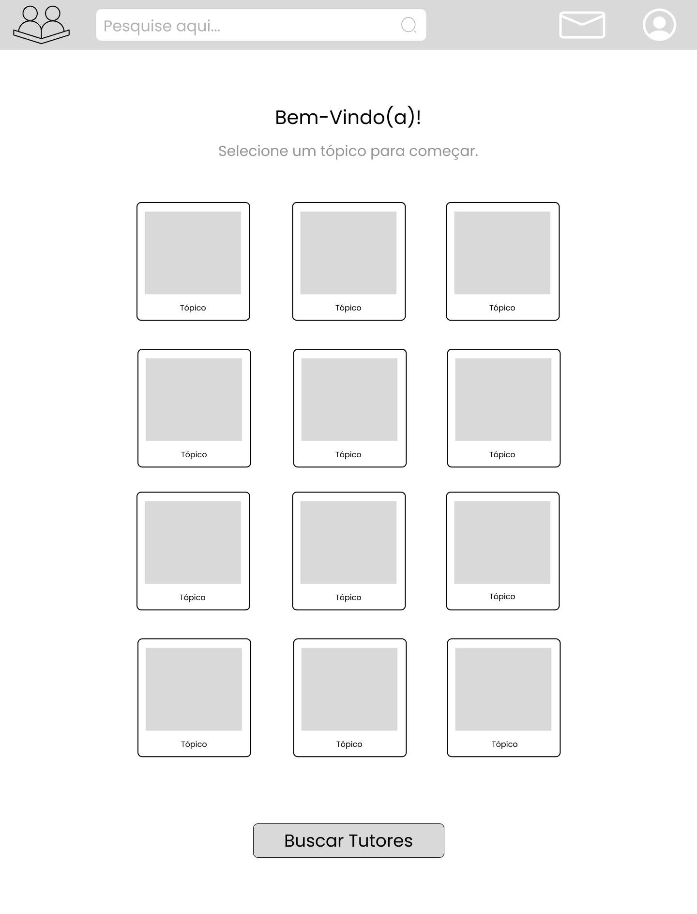

## 🖼️ Wireframes

### Tela inicial
A tela inicial possui uma breve introdução sobre o projeto, e possui opções para o usuário fazer login ou se cadastrar caso não tenha uma conta.

### Cadastro
No cadastro, o usuário digita seu nome de usuário, e-mail e senha, e seleciona se deseja ser aluno (pedir ajuda para estudos) ou instrutor (lecionar alunos sobre tópicos a escolha do usuário) ou ambos.

Alunos a partir do fundamental podem fazer uso da ferramenta.

Instrutores são restritos para pessoas que, no mínimo, completaram o ensino fundamental. Além disso, instrutores devem mandar um certificado de conclusão da escola/ensino superior, garantindo que possuem educação sobre as matérias as quais irão dar aula.

Ao realizar o login, o usuário pode escolher um ou mais tópicos que deseja ajuda.

