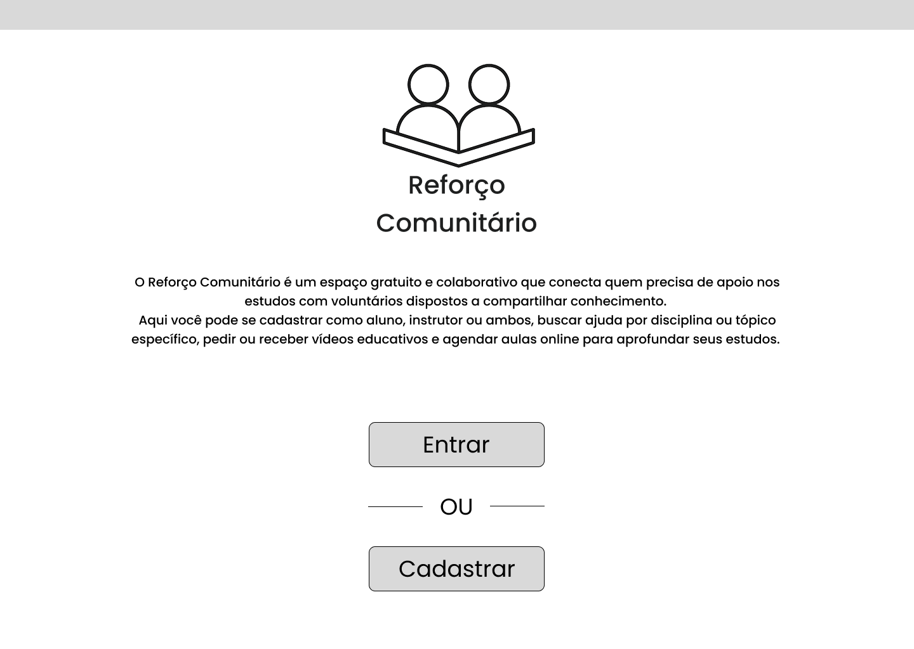
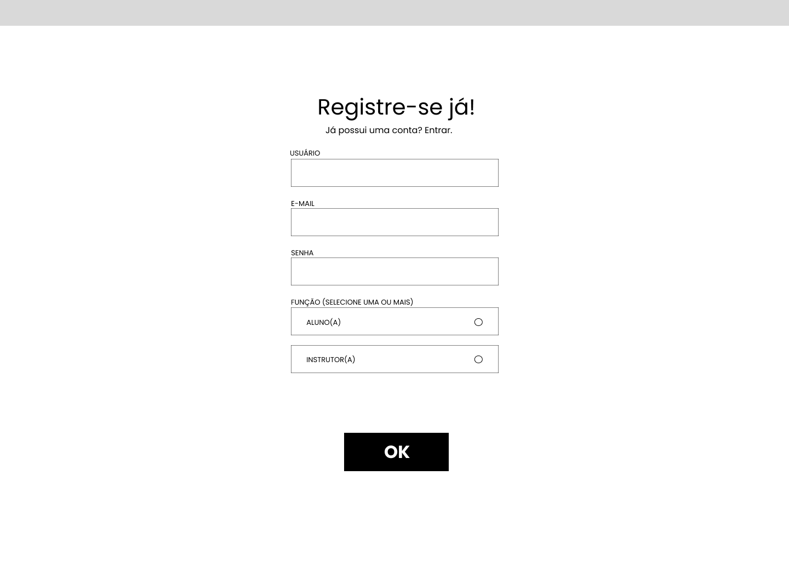
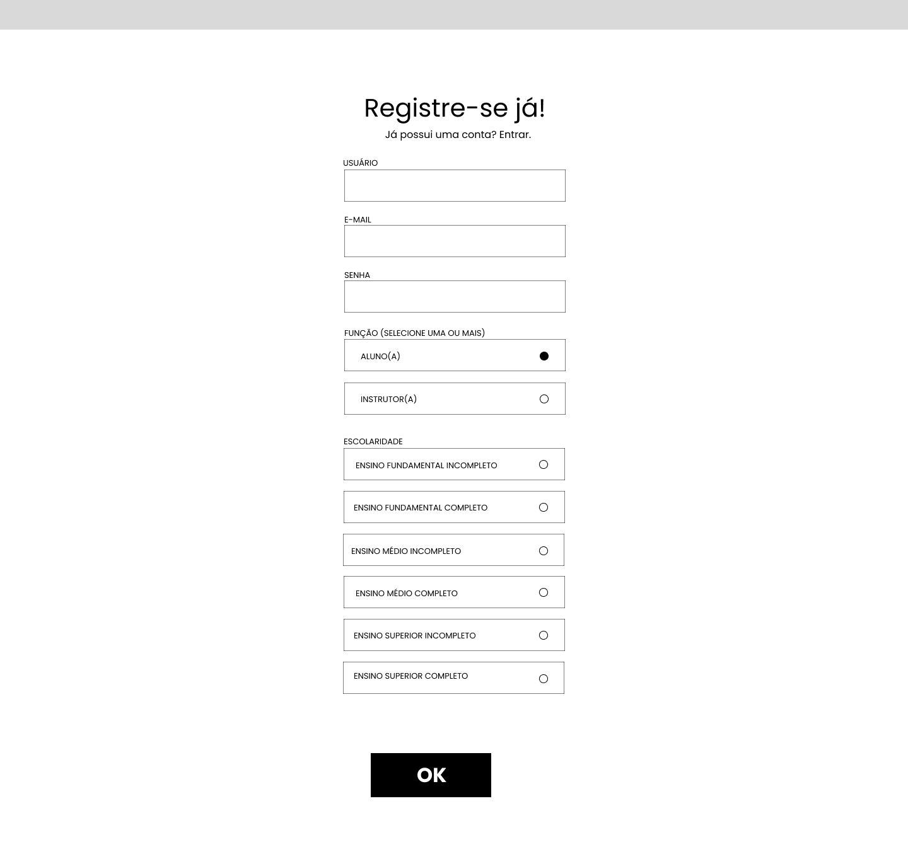
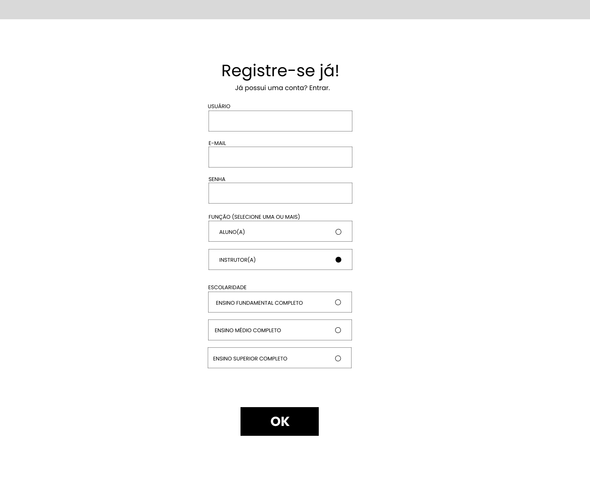
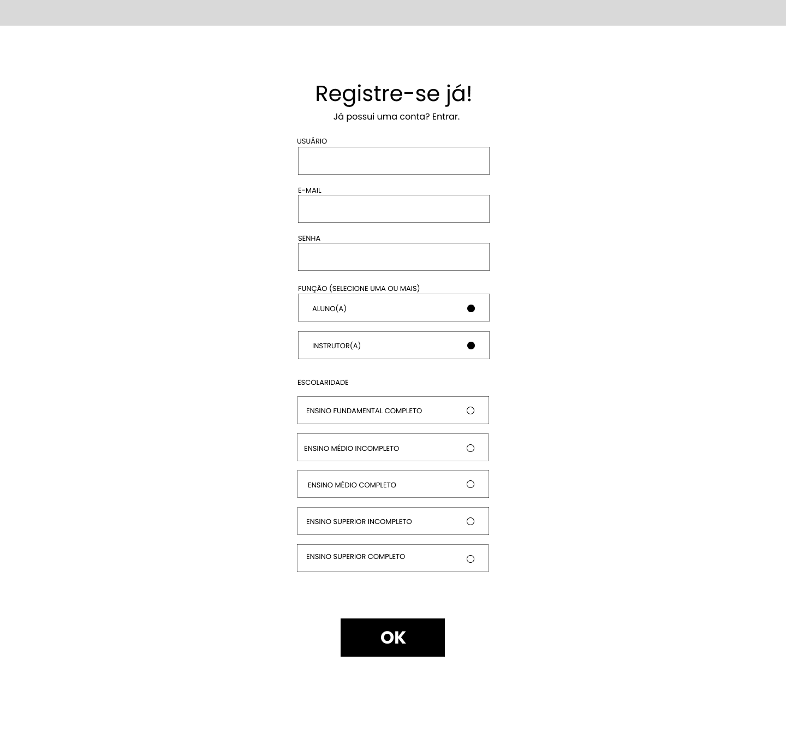
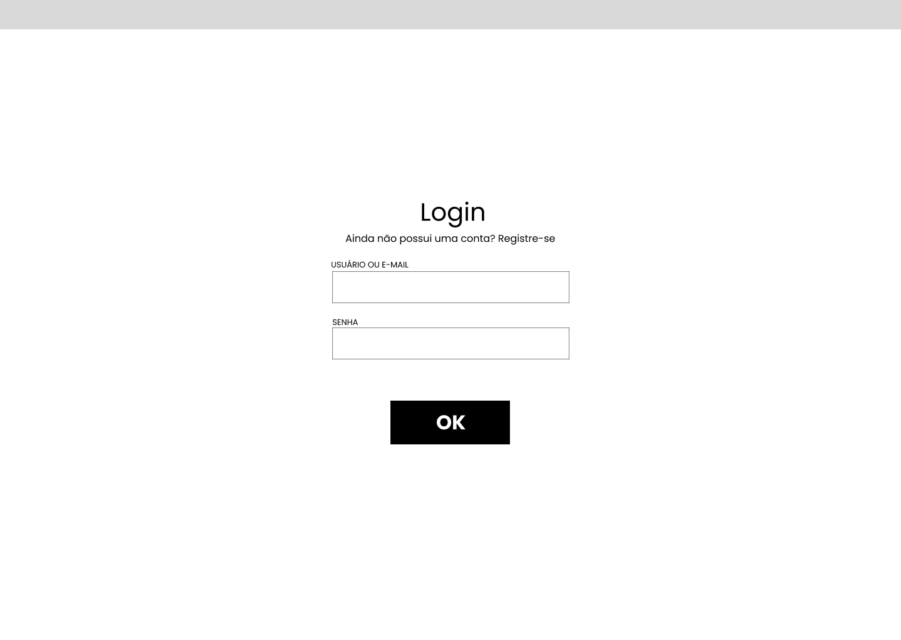
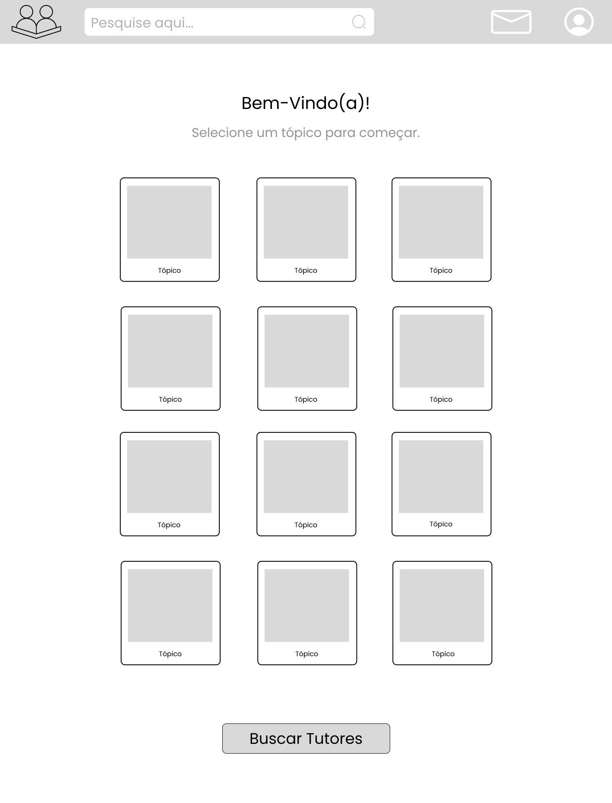
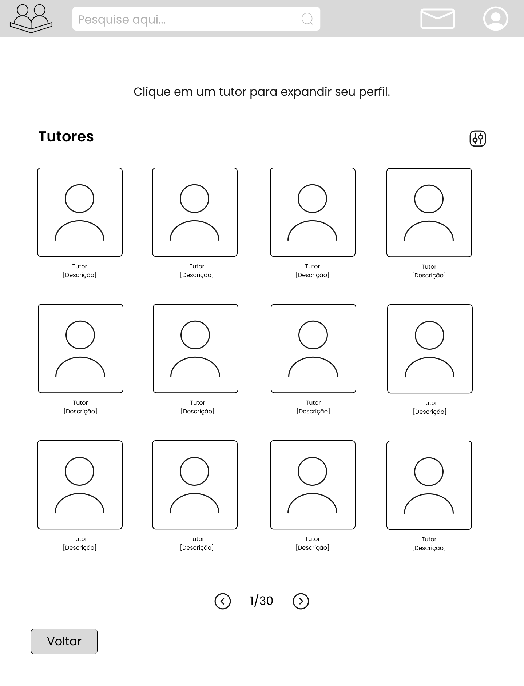

# 🖼️ Wireframes

## Tela inicial
A tela inicial apresenta brevemente o projeto e oferece duas ações principais: entrar em uma conta existente ou iniciar um novo cadastro.



## Cadastro
No cadastro, o usuário informa nome de usuário, e-mail e senha e escolhe se deseja atuar como aluno, instrutor ou nas duas funções.



Os wireframes também preveem variações do cadastro conforme a função escolhida. Para alunos, a proposta considera usuários a partir do ensino fundamental.



Para instrutores, o protótipo prevê requisitos adicionais de escolaridade e comprovação de formação.





> **Observação:** essas etapas adicionais do cadastro ainda não estão implementadas na versão atual do código. O formulário atual coleta apenas usuário, e-mail, senha e função.

## Login
No login, o usuário informa seu nome de usuário ou e-mail e a senha.



## Tópicos
Após entrar na plataforma, o usuário pode selecionar um ou mais tópicos em que deseja encontrar apoio.



## Tutores
Depois da seleção dos tópicos, a aplicação direciona o usuário à tela de tutores e filtra os professores de acordo com as matérias escolhidas.



---

# 📚 Tutorial

## 1. Estrutura de pastas

A organização atual do projeto é:

```text
src/
├── assets/
│   ├── logo.png
│   ├── arrow-left.svg
│   ├── arrow-right.svg
│   ├── tutor-icon.svg
│   ├── topics-images/
│   └── tutor-images/
│
├── common/
│   ├── auth.css
│   ├── components.css
│   └── global.css
│
└── pages/
    ├── home/
    │   ├── home.html
    │   └── home.css
    ├── login/
    │   ├── login.html
    │   └── login.js
    ├── register/
    │   ├── register.html
    │   ├── register.css
    │   └── register.js
    ├── topics/
    │   ├── topics.html
    │   ├── topics.css
    │   └── topics.js
    └── tutors/
        ├── tutors.html
        ├── tutors.css
        └── tutors.js

tutorial/
├── tutorial.md
└── wireframes/
```

Os estilos reutilizados por várias páginas ficam em `src/common`. Os estilos e scripts específicos permanecem dentro da pasta da própria página. Essa separação evita repetição e facilita localizar cada responsabilidade.

---

## 2. Como abrir o projeto

O projeto utiliza HTML, CSS e JavaScript puros. Não existe etapa de compilação nem arquivo de dependências como `package.json`.

A tela inicial pode ser aberta diretamente por:

```text
src/pages/home/home.html
```

Também é possível abrir individualmente:

```text
src/pages/login/login.html
src/pages/register/register.html
src/pages/topics/topics.html
src/pages/tutors/tutors.html
```

A fonte Poppins é importada do Google Fonts; portanto, é necessário acesso à internet para carregá-la. Caso ela não seja carregada, o navegador utiliza a fonte genérica `sans-serif` definida como alternativa.

---

## 3. Fluxo atual da aplicação

O fluxo implementado atualmente é:

```text
Home
  ├── Entrar ──────> Login ──────> Tópicos
  └── Cadastrar ───> Cadastro ───> Tópicos
                                  ↓
                          seleção de matérias
                                  ↓
                               Tutores
```

Na tela de tópicos, as matérias selecionadas são armazenadas temporariamente no `sessionStorage`. A tela de tutores recupera essa informação e exibe apenas professores relacionados a pelo menos uma das matérias selecionadas.

---

## 4. Estrutura HTML comum

As páginas começam com a estrutura padrão do HTML5:

```html
<!DOCTYPE html>
<html lang="pt-BR">
```

`<!DOCTYPE html>` informa que o documento utiliza HTML5. Já `lang="pt-BR"` identifica o idioma principal da página, o que auxilia mecanismos de busca e tecnologias assistivas.

No `<head>` aparecem configurações importantes:

```html
<meta charset="UTF-8">
<meta name="viewport" content="width=device-width, initial-scale=1.0">
```

- `charset="UTF-8"` permite acentos e outros caracteres especiais;
- `viewport` permite que o layout se adapte corretamente à largura de celulares e tablets;
- `<link rel="stylesheet">` importa os arquivos CSS necessários para a página.

O projeto utiliza elementos semânticos como:

- `<header>`: cabeçalho da página;
- `<main>`: conteúdo principal;
- `<section>`: agrupa uma área temática;
- `<article>`: representa um item independente, como um card;
- `<nav>`: representa uma área de navegação, como a paginação;
- `<form>`: agrupa campos que recebem dados do usuário;
- `<label>`: identifica ou envolve um controle de formulário.

---

## 5. Organização dos estilos compartilhados

### `src/common/global.css`

O arquivo global começa importando a fonte Poppins:

```css
@import url('https://fonts.googleapis.com/css2?family=Poppins:wght@400;700&display=swap');
```

O seletor universal remove margens e paddings padrão e utiliza `border-box`:

```css
* {
    box-sizing: border-box;
    margin: 0;
    padding: 0;
}
```

Com `box-sizing: border-box`, a largura e a altura informadas já incluem `padding` e borda, o que facilita controlar o tamanho real dos componentes.

O `body` aplica a fonte Poppins e a cor de fundo geral `#FFF4E6`.

O `.header` cria a barra superior verde-clara, com 70 pixels de altura, e utiliza Flexbox para alinhar seus elementos horizontalmente:

```css
.header {
    height: 70px;
    background-color: #a0db8e;
    display: flex;
    align-items: center;
    padding: 0 20px;
}
```

As classes compartilhadas incluem:

- `.logo`: controla o tamanho da logo usada nos cabeçalhos internos;
- `.content`: aplica espaçamento ao conteúdo principal;
- `.title`: estiliza os títulos principais;
- `.subtitle`: estiliza os textos secundários.

O arquivo também contém media queries globais para telas de até `768px` e `480px`. Nessas larguras, o padding de `.content` e os tamanhos de `.title` e `.subtitle` diminuem.

### `src/common/components.css`

Este arquivo reúne componentes reutilizados em mais de uma tela.

A `.search-bar` é utilizada nas páginas de tópicos e tutores. Ela usa Flexbox, borda verde, fundo branco e largura de 600 pixels. O campo interno ocupa toda a largura disponível e remove a borda padrão do navegador.

Também existe um estilo base para `.btn-submit`, reutilizado em botões e links com aparência de botão:

```css
.btn-submit {
    border: none;
    border-radius: 10px;
    background-color: #065535;
    color: #ffffff;
    font-family: Poppins, sans-serif;
    cursor: pointer;
}
```

O pseudoestado `:hover` altera a cor quando o cursor passa sobre o componente.

### `src/common/auth.css`

O `auth.css` reúne os estilos compartilhados pelas telas de login e cadastro.

- `.form` ocupa até 351 pixels e se adapta a telas menores;
- `.form-group` cria espaçamento entre os campos;
- os inputs recebem 100% da largura do formulário e 51 pixels de altura;
- `:focus` altera a borda do campo ativo;
- `.btn-submit:disabled` cria o estado visual de botão bloqueado;
- media queries reduzem formulário, campos e botão em telas menores.

Essa organização evita repetir as mesmas regras em `login` e `register`.

---

## 6. Tela inicial: `home.html` e `home.css`

A página inicial importa `global.css` e `home.css`.

Seu conteúdo principal é organizado por `.home-content` e contém:

1. a logo principal do projeto;
2. o título **Reforço Comunitário**;
3. dois parágrafos explicativos;
4. o botão **Entrar**;
5. o separador `OU`;
6. o botão **Cadastrar**.

Os botões utilizam `onclick` para navegar diretamente:

```html
<button
    class="home-button"
    type="button"
    onclick="window.location.href='../login/login.html'">
    Entrar
</button>
```

O segundo botão utiliza a mesma lógica para abrir a tela de cadastro.

No CSS:

- `.home-logo` possui largura máxima responsiva;
- `.home-description` limita o texto a 900 pixels;
- `.home-actions` usa `display: flex` com `flex-direction: column`;
- `.home-button` define tamanho, cores, borda e estado `:hover`;
- media queries adaptam logo, textos e botões para telas menores.

### Separador `OU`

O texto `OU` utiliza `::before` e `::after` para criar uma linha de cada lado:

```css
.divider::before,
.divider::after {
    content: "";
    flex: 1;
    height: 2px;
    background-color: #065535;
}
```

Os pseudo-elementos não existem no HTML; são criados pelo CSS apenas para fins visuais.

---

## 7. Cadastro: `register.html`, `auth.css`, `register.css` e `register.js`

O cadastro utiliza um `<form>` com três campos obrigatórios:

- usuário;
- e-mail;
- senha.

Cada campo possui um `<label>` associado ao input pelo mesmo valor de `for` e `id`:

```html
<label for="email">E-MAIL</label>
<input type="email" id="email" name="email" required>
```

Essa associação permite clicar no rótulo para focar o campo e melhora a acessibilidade.

O atributo `required` informa ao navegador que o campo precisa ser preenchido. O `type="email"` também ativa a validação nativa do formato do e-mail.

### Seleção de função

Aluno e instrutor são implementados com checkboxes porque o usuário pode selecionar uma ou as duas funções:

```html
<input type="checkbox" name="funcao" value="aluno">
<input type="checkbox" name="funcao" value="instrutor">
```

Os dois controles possuem o mesmo `name="funcao"`, mas valores diferentes.

Cada checkbox está dentro de um `<label class="checkbox-card">`, portanto clicar no card também altera o checkbox.

No `register.css`, `appearance: none` remove a aparência padrão do checkbox. O CSS cria um controle circular e utiliza `:checked` para indicar a seleção.

O seletor:

```css
.form-group > label:not(.checkbox-card)
```

estiliza apenas os labels comuns dos campos, excluindo os labels que funcionam como cards.

### Validação em `register.js`

O botão `OK` começa desabilitado:

```html
<button type="submit" class="btn-submit" disabled>OK</button>
```

O script seleciona o formulário, o botão e os checkboxes de função. A função `validateForm()` utiliza:

```js
form.checkValidity()
```

para verificar os campos obrigatórios e:

```js
Array.from(checkboxes).some(checkbox => checkbox.checked)
```

para conferir se pelo menos uma função foi escolhida.

Enquanto alguma condição estiver pendente, o botão continua desabilitado. Quando tudo estiver válido, o botão é liberado.

No envio, o script usa:

```js
event.preventDefault();
```

para impedir o envio tradicional do formulário e redireciona para:

```js
window.location.href = '../topics/topics.html';
```

Os dados ainda não são enviados nem armazenados em um backend.

---

## 8. Login: `login.html`, `auth.css` e `login.js`

A tela de login reutiliza `global.css`, `components.css` e `auth.css`.

Ela possui dois campos obrigatórios:

```html
<input type="text" id="usuario" name="usuario" required>
<input type="password" id="senha" name="senha" required>
```

O botão `OK` também começa com `disabled`.

No `login.js`, `form.checkValidity()` verifica se os campos obrigatórios estão preenchidos. A cada evento `input`, o estado do botão é atualizado:

```js
form.addEventListener('input', validateForm);
```

Quando o formulário é enviado, o JavaScript impede o comportamento padrão e direciona o usuário à página de tópicos.

> **Importante:** essa tela ainda não autentica um usuário de verdade. Qualquer conteúdo válido nos campos permite seguir para a próxima página, pois não existe backend ou banco de dados conectado.

Além disso, o link **Registre-se** atualmente usa `href="#"`, portanto ainda não direciona para `register.html`.

---

## 9. Seleção de tópicos: `topics.html`, `topics.css` e `topics.js`

A página de tópicos reutiliza o cabeçalho com logo e barra de pesquisa.

### Lista de tópicos

Em vez de escrever os 12 cards manualmente no HTML, `topics.js` mantém uma lista de objetos:

```js
const topics = [
    { name: 'Matemática', image: 'topico-matematica.jpg' },
    { name: 'Português', image: 'topico-portugues.jpg' },
    // ...
];
```

Cada objeto possui:

- `name`: nome da matéria;
- `image`: nome do arquivo correspondente em `assets/topics-images`.

Atualmente estão disponíveis 12 tópicos:

- Matemática;
- Português;
- Redação;
- História;
- Geografia;
- Inglês;
- Física;
- Química;
- Biologia;
- Artes;
- Educação Financeira;
- Programação.

### Criação dinâmica dos cards

O JavaScript cria uma `<section class="topics-grid">` e percorre o array com `forEach()`.

Para cada tópico, são criados dinamicamente:

- `<article class="topic-card">`;
- `<label>`;
- `<input type="checkbox">`;
- a imagem da matéria;
- `<span class="topic-name">`.

Depois o card é inserido no grid, que é colocado antes do botão **Buscar Tutores**.

Isso reduz repetição no HTML: para adicionar um novo tópico, basta acrescentar outro objeto ao array e fornecer sua imagem.

### Seleção visual

O checkbox fica escondido:

```css
.topic-checkbox {
    display: none;
}
```

O card inteiro continua clicável porque o conteúdo está dentro de um `<label>`.

O CSS usa `:has()` para estilizar o card selecionado:

```css
.topic-card:has(.topic-checkbox:checked)
```

Assim, o card muda a borda e o fundo quando seu checkbox está marcado.

### Pesquisa de tópicos

A barra de pesquisa possui um listener para o evento `input`. O texto digitado é normalizado com:

```js
.toLowerCase().trim()
```

Cada card é comparado pelo conteúdo de `.topic-name`. Os cards que não correspondem à busca recebem:

```js
card.style.display = 'none';
```

### Armazenamento das matérias selecionadas

Quando o usuário aciona **Buscar Tutores**, o script encontra todos os checkboxes marcados:

```js
document.querySelectorAll('.topic-checkbox:checked')
```

Os valores são transformados em um array e gravados no `sessionStorage`:

```js
sessionStorage.setItem(
    'topicosSelecionados',
    JSON.stringify(topicosEscolhidos)
);
```

`sessionStorage` armazena dados temporariamente durante a sessão da aba do navegador. Como ele armazena texto, `JSON.stringify()` converte o array para uma string. Na página de tutores, `JSON.parse()` realiza o processo inverso.

### Layout responsivo

No desktop, `.topics-grid` utiliza quatro colunas de 235 pixels, formando três linhas de quatro cards. Media queries reduzem progressivamente o grid para:

- 3 colunas em telas menores que 1250px;
- 2 colunas em telas menores que 950px;
- 1 coluna em telas menores que 650px.

### Ponto de atenção no código atual

O elemento **Buscar Tutores** é um `<a href="../tutors/tutors.html">`. O listener mostra um alerta quando nenhum tópico foi selecionado, mas atualmente não chama `event.preventDefault()` nesse caso. Portanto, o navegador ainda pode seguir o link mesmo após o alerta.

Para bloquear de fato a navegação sem seleção, o listener deve receber o evento e impedir a ação padrão quando o array estiver vazio, ou o link deve ser substituído por um `<button>` controlado pelo JavaScript.

---

## 10. Lista de tutores: `tutors.html`, `tutors.css` e `tutors.js`

A página de tutores também cria seus cards dinamicamente.

### Dados dos tutores

`tutors.js` possui um array de objetos. Cada tutor contém:

```js
{
    name: 'Maria Cláudia Carvalho',
    image: 'Maria-Claudia-Carvalho.jpg',
    topics: ['Matemática', 'Física', 'Química']
}
```

Assim, cada registro guarda:

- nome;
- arquivo da foto;
- matérias que o professor leciona.

As fotos ficam em `assets/tutor-images`.

### Recuperação dos tópicos escolhidos

O script lê a seleção feita na página anterior com:

```js
const selectedTopics =
    JSON.parse(sessionStorage.getItem('topicosSelecionados')) || [];
```

Se não houver nada armazenado, é utilizado um array vazio.

### Filtro por matéria

A função `filterTutors()` combina dois critérios:

1. matérias selecionadas na página anterior;
2. texto digitado na barra de pesquisa.

O filtro de matérias utiliza `some()`:

```js
selectedTopics.some((topic) => tutor.topics.includes(topic))
```

Isso significa que um tutor aparece se lecionar **pelo menos uma** das matérias escolhidas.

Quando nenhuma matéria existe no `sessionStorage`, todos os tutores podem ser exibidos.

### Criação dinâmica dos cards

A função `createTutorCard(tutor)` cria:

- `<article class="tutor-card">`;
- `<label class="tutor-label">`;
- um checkbox oculto;
- a foto do professor;
- um `<h3>` com o nome.

O card inteiro fica clicável por estar dentro de um `<label>`.

Embora a classe do input seja `.tutor-radio`, o elemento criado atualmente é um `checkbox`. O JavaScript controla manualmente para que apenas um tutor permaneça selecionado por vez.

Esse uso de checkbox também permite clicar novamente no mesmo tutor para desselecioná-lo, comportamento que um `radio` comum não oferece diretamente.

### Seleção de apenas um tutor

Ao marcar um tutor, o script percorre os outros inputs e desmarca todos os demais:

```js
document.querySelectorAll('.tutor-radio').forEach((item) => {
    if (item !== checkbox) {
        item.checked = false;
    }
});
```

O nome selecionado é armazenado na variável `selectedTutor`. Assim, ao trocar de página e voltar, o card correspondente pode ser marcado novamente durante a renderização.

### Paginação

A constante:

```js
const tutorsPerPage = 12;
```

define que até 12 professores aparecem por página.

O script calcula o intervalo da página atual:

```js
const start = (currentPage - 1) * tutorsPerPage;
const end = start + tutorsPerPage;
const tutorsOnPage = filteredTutors.slice(start, end);
```

`slice()` extrai apenas o trecho do array que deve aparecer naquela página.

A quantidade total de páginas é calculada com:

```js
Math.ceil(filteredTutors.length / tutorsPerPage)
```

Os botões `#prev-page` e `#next-page` alteram `currentPage` e chamam `renderTutors()` novamente. Quando o usuário está na primeira ou última página, o botão correspondente é desabilitado.

O indicador `.pagination-current` é atualizado dinamicamente, por exemplo:

```text
1 / 2
```

### Pesquisa de tutores

A barra de pesquisa filtra os professores pelo nome. Esse filtro é aplicado junto com o filtro das matérias selecionadas, e a paginação volta para a página 1 sempre que a pesquisa muda.

### Botão Voltar

O botão **Voltar** é um link funcional:

```html
<a href="../topics/topics.html" class="btn-submit">Voltar</a>
```

Ele retorna diretamente à tela de tópicos.

### Layout responsivo

No desktop, `.tutors` possui quatro colunas de 235 pixels, permitindo exibir 12 cards como três linhas de quatro.

As media queries reduzem o grid para:

- 3 colunas abaixo de 1100px;
- 2 colunas abaixo de 850px;
- 1 coluna abaixo de 600px.

---

## 11. Responsividade

A responsividade do projeto é dividida entre regras globais e regras específicas.

### Regras globais

Em `global.css`, as media queries diminuem:

- padding do conteúdo;
- tamanho dos títulos;
- tamanho dos subtítulos.

Essas regras afetam todas as páginas que utilizam `.content`, `.title` e `.subtitle`.

### Regras específicas

Cada tela ajusta aquilo que é exclusivo do seu layout:

- `home.css`: logo, textos, botões e separador;
- `auth.css`: formulário, inputs e botão;
- `register.css`: cards de função;
- `topics.css`: número de colunas do grid;
- `tutors.css`: número de colunas do grid.

Essa divisão evita colocar no arquivo global regras que só fazem sentido para uma página.

---

## 12. Conceitos de JavaScript utilizados

O projeto já utiliza vários conceitos importantes de JavaScript no navegador.

### Seleção de elementos

```js
document.querySelector('.form');
document.querySelectorAll('.topic-checkbox:checked');
```

- `querySelector()` retorna o primeiro elemento correspondente;
- `querySelectorAll()` retorna uma coleção de todos os elementos correspondentes.

### Criação de elementos

```js
const card = document.createElement('article');
card.classList.add('topic-card');
```

O DOM é modificado dinamicamente sem precisar escrever todos os cards diretamente no HTML.

### Eventos

```js
form.addEventListener('input', validateForm);
nextButton.addEventListener('click', () => { ... });
```

`addEventListener()` associa uma função a uma interação do usuário.

### Métodos de arrays

O projeto utiliza:

- `forEach()` para percorrer itens;
- `filter()` para criar listas filtradas;
- `some()` para verificar se ao menos um item atende a uma condição;
- `map()` para transformar uma lista em outra;
- `slice()` para separar os tutores de uma página;
- `Array.from()` para converter coleções em arrays comuns.

### `sessionStorage`

O `sessionStorage` permite compartilhar temporariamente dados entre as páginas da mesma aba. No projeto, ele conecta a escolha de tópicos à filtragem de tutores.

---

## 13. Assets

Os principais assets são:

- `logo.png`: marca da plataforma;
- `arrow-left.svg` e `arrow-right.svg`: setas da paginação;
- `topics-images/`: imagens JPG dos tópicos;
- `tutor-images/`: fotos JPG/PNG dos tutores;

---

## 14. Limitações e próximos passos

Os principais pontos que faltam para uma aplicação completa são:

- realmente cadastrar e persistir usuários;
- autenticar credenciais no login;
- implementar telas de edição de perfil e fórum;
- implementar os campos adicionais previstos nos wireframes para aluno/instrutor;
- criar modal com o perfil completo do tutor, ao ser selecionado;
- utilizar a seleção do tutor para iniciar ações reais, como solicitar ou agendar uma aula;
- considerar melhorias de acessibilidade, especialmente para controles ocultos com `display: none` e navegação por teclado;
- possivelmente implementar backend e banco de dados.